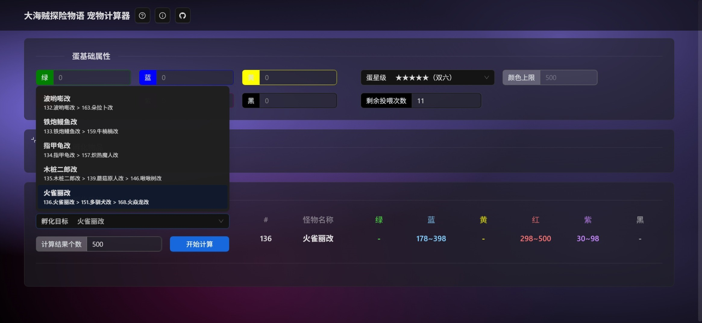
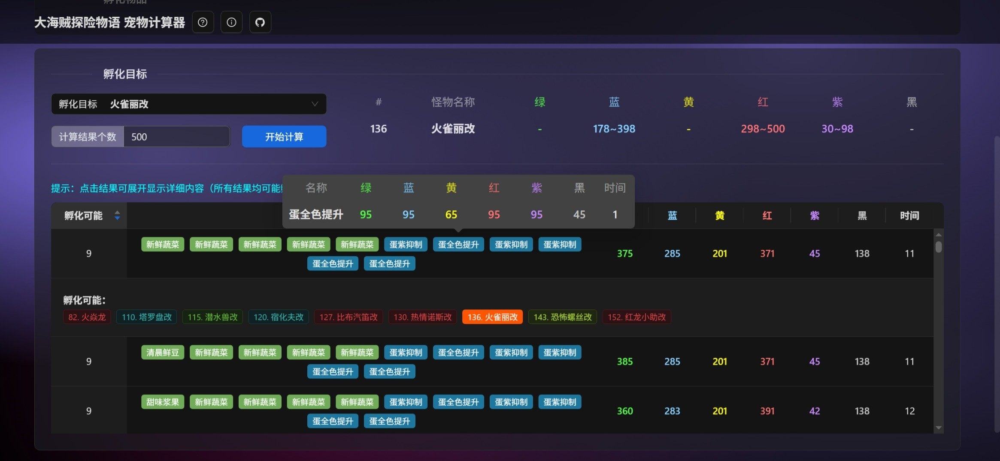
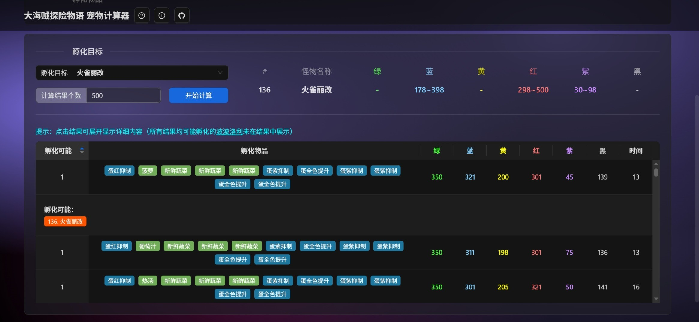
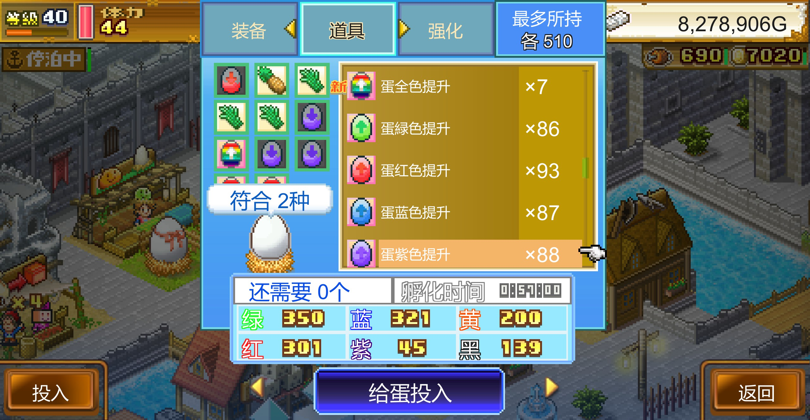
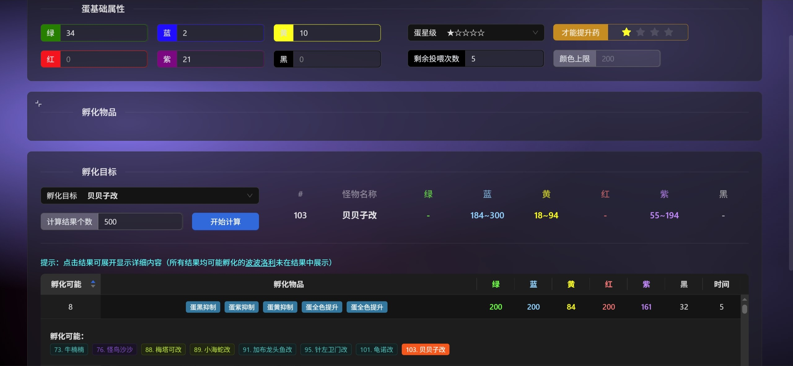
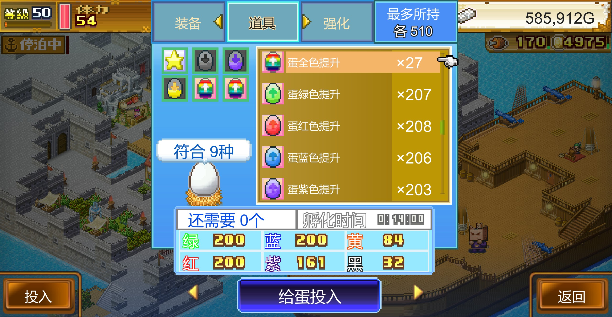

# 大海贼探险物语 DX（大航海探险物语） 宠物计算器

## 简介

本项目受[《大航海探险物语》工具箱](https://gitee.com/zhaijifu67/dahanghai)启发，采用 TypeScript + React 编写。
纯前端技术应用，免费且开源，无需后端服务器支持。使用预处理启发式算法，能够在短时间内计算出大量准确的孵化方案，为玩家提供高效便捷的宠物孵化辅助工具。

## 链接

在线地址：<https://dreamnya.github.io/HighSeaSaga-PetCalculator>

GitHub 仓库：<https://github.com/DreamNya/HighSeaSaga-PetCalculator>

_（本项目运行于免费服务器，长期有效，欢迎 Star 和 PR。如发现 Bug，可在 GitHub 发起 Issue）_  
_目前项目已完成算法代码、基本界面、交互 UI、简单物品及宠物图鉴。未做响应式适配，低分辨率设备访问可能效果较差。_
_由于缺少足够资料、工程量过大，本项目计划只专注于宠物计算器。如有更好的建议可在 GitHub 发起 Issue_

## 使用方法

1. 蛋基础属性  
    根据蛋当前情况填写 6 种颜色、星级及剩余次数  
   （剩余次数需在修改星级后修改）

2. 孵化物品  
   默认勾选食物及蛋色物品。其他物品、装备可展开面板后按需勾选  
   （勾选物品列表可记忆，下次打开页面无需重新勾选）

3. 孵化目标
   选择或搜索孵化目标，点击开始计算即可极速计算出准确目标  
   （可显示计算结果无上限，轻微影响计算速度）

4. 孵化方案  
   孵化结果可按孵化可能排序，点击结果可展开显示具体孵化可能  
   （点击孵化物品、宠物标签可预览简单属性）

## 才能提升药(v0.1.1)

现支持设置额外才能提升药提升蛋星级，最大支持使用（5-星级）个才能提升药，计算结果时会自动计算对应属性，无需手动修改蛋基础属性

## 孵化方案

**游戏基础概念本文不再赘述，建议查询相关资料攻略**  
为简化算法，本项目算法仅考虑是否使用`已勾选物品`，而不考虑`已勾选物品`的价值、剩余数量，如有需要可自行抉择是否勾选。全选物品会轻微影响算法速度，但主要会污染孵化方案。  
由于所有孵化方案均能孵化出【波波洛利】，故孵化方案中故意省略了【波波洛利】，若想 100%或高概率孵化出目标宠物，建议按`孵化可能`排序，页面中显示为 1（即游戏中显示为**2**）的代表该方案除了【波波洛利】仅可能孵化出目标宠物。
（前提是最终实际孵蛋颜色和方案颜色相同，详见下文）

## 投喂方法

由于宠物孵化算法复杂度极高，经由 DeepSeek 优化，运用预处理+启发式算法进行剪枝优化。有效减少了大量不必要的遍历计算，从而显著提升了计算效率。 故其计算结果无法达到 100% 完美。再验证确保了计算结果的基本准确性。仅极端情况下，算法可能会出现微小误差（主要集中在可能出现负数部分）  
为了进一步简化算法流程，本项目采取了一次性投喂法，即一次性投喂所有剩余的孵化物品。 故在具体算法实现中会出现负数计算。但由于实际游戏中，投喂颜色最小为 0 不会出现负数，因此投喂顺序对于孵化结果至关重要  
基于此，建议用户在投喂操作时，遵循`先选后喂、后选先喂`的原则，优先选择负数食物，再选择正数食物。这样的投喂顺序能够最大程度地优化算法效果，确保孵化结果的准确性和可靠性。

具体算法详见源码：[src/script/CalcSolutions.ts](src/script/CalcSolutions.ts)

## 示例

## 更新记录

### v0.1.1

- 功能 现支持设置额外才能提升药
- 修复 孵化计算结果颜色不再超出蛋星级对应的颜色上限
